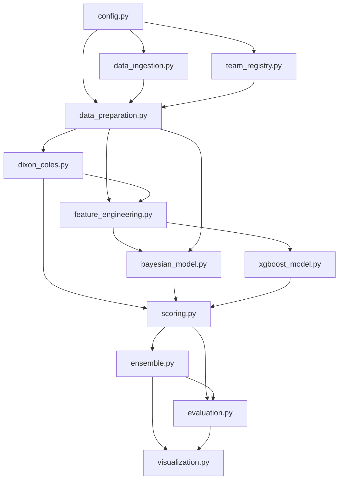

# Football Score Prediction — Technical Design Document

**Project:** International fixture score prediction (Dixon-Coles + Bayesian hierarchical + XGBoost ensemble)
**Reference dataset:** `martj42/international_results` (`results.csv`), filtered to 2018-present
**Primary demo fixture:** Jordan vs Argentina, 2026-06-27 (FIFA World Cup, neutral venue)
**Stack:** Python 3.14+, Polars, NumPy, SciPy, PyMC, ArviZ, XGBoost, Optuna, Scikit-Learn, Matplotlib, Seaborn

This document specifies the system before any implementation. It is organized into six parts: Architecture Document, Dependency Graph, Section-by-Section Notebook Plan, Function Inventory, Dataclass Inventory, and Risk Analysis.

---

## 1. Architecture Document

### 1.1 Overview & Goals

The system predicts the full scoreline probability distribution for a single international football fixture, not just a 1X2 outcome. It does this by combining three independent estimators of each team's goal-scoring and goal-conceding rates:

| Stage | Method | Role |
| ----- | ------ | ---- |
| A | Dixon-Coles (weighted MAP fit via SciPy) | Fast frequentist baseline; source of engineered features; only component with the explicit low-score `tau` correlation correction |
| B | Bayesian hierarchical Poisson model (PyMC / NUTS) | Same generative structure as A, but fully posterior — gives credible intervals on every team's attack/defense and a posterior-predictive scoreline distribution for the target fixture |
| C | XGBoost (two Poisson-objective regressors, Optuna-tuned) | Non-parametric correction layer that can pick up nonlinear interactions and recent-form signal that a linear log-rate model cannot |

Each stage outputs a full `(K+1) x (K+1)` scoreline probability matrix for a given fixture (`K` = max modeled goals, default 10). The matrices are combined by a weighted ensemble (Section 1.7) into the final prediction, which feeds the three required visualizations (scoreline heatmap, 1X2 bar chart, top-10 scoreline bar chart) and the backtest metrics.

Design goals, in priority order:

1. **No leakage** — every number used to predict a match must have been knowable strictly before that match was played.
2. **Honest backtesting** — a chronological holdout, not a random split, with metrics reported per model and for the ensemble.
3. **Reproducibility** — every stochastic component (NUTS, Optuna, XGBoost) takes an explicit seed.
4. **Auditable weighting** — competition-importance and recency weighting must be unit-testable against the actual tournament name strings in the dataset (this requirement exists because an earlier draft of this notebook had two confirmed weighting bugs: an un-normalized accented string comparison that silently misweighted Copa América, and a substring-precedence bug that equated qualifiers with finals for the World Cup, Euro, and Nations League).

### 1.2 System Architecture / Module Map

The notebook is implemented as a sequence of cells, but every cell only calls functions defined in one of the following logical modules. Treating the notebook as "thin orchestration over importable modules" keeps cells short and keeps every function independently unit-testable.

```txt
config.py              Configuration dataclasses and constants (Section 1.3)
data_ingestion.py       Raw CSV fetch, schema validation, caching
team_registry.py        FIFA-code <-> dataset team-name resolution, core-team selection
data_preparation.py     Played/upcoming split, date filtering, weighting, chronological split
dixon_coles.py           Weighted MAP fit (attack/defense/home-advantage/rho), tau correction
bayesian_model.py       PyMC hierarchical model build/fit, convergence diagnostics, posterior extraction
feature_engineering.py  Leak-free rolling form, static DC features, current-form snapshot for fixtures
xgboost_model.py         Training, Optuna search space + objective, prediction
scoring.py               Poisson/DC scoreline matrix construction, outcome collapse, top-N extraction
ensemble.py               Backtest-weighted combination of per-model matrices
evaluation.py             Backtest metric computation, calibration diagnostics
visualization.py          Heatmap, outcome bar chart, top-10 bar chart, diagnostic plots
```

Module dependency direction is strictly top-to-bottom in the list above; no module imports from a module below it. `config.py` has no project dependencies and is imported everywhere.

### 1.3 Configuration Objects

Configuration is centralized in frozen dataclasses (Section 5 has full field lists) so that every notebook run is fully described by a single `PipelineConfig` object that can be logged, hashed, or serialized for reproducibility:

- `DataConfig` — source URL/path, schema expectations, start date.
- `TeamFilterConfig` — minimum-match threshold for the "core team" universe.
- `WeightingConfig` — half-life for time decay, tournament-importance weight table.
- `SplitConfig` — chronological train/test cutoff date.
- `DixonColesConfig` — optimizer choice, regularization (prior) scale, max iterations.
- `BayesianConfig` — draws, tune, chains, target_accept, prior widths, random seed.
- `FeatureConfig` — rolling-window size(s), feature column list.
- `XGBoostConfig` — fixed params and Optuna search space bounds.
- `OptunaConfig` — n_trials, timeout, sampler, pruner, CV fold count.
- `EnsembleConfig` — combination method and any fixed/learned weights.
- `FixtureConfig` — the specific match to headline (teams, date, neutral flag).
- `EvaluationConfig` — max goals represented, metric list.

All of these compose into one top-level `PipelineConfig` dataclass (Section 5) passed explicitly to top-level orchestration functions rather than read from globals — this is what makes the same notebook usable for a different fixture or a different train/test cutoff without editing function bodies.

### 1.4 Data Flow Between Sections

```txt
raw CSV (results.csv)
  -> typed Polars DataFrame                          [data_ingestion]
  -> played / upcoming split                          [data_preparation]
  -> date filter >= 2018-01-01                        [data_preparation]
  -> core-team universe selection (>= N matches)       [team_registry]
  -> filter matches to core teams                      [team_registry]
  -> chronological split: train (< cutoff) / test (>= cutoff)   [data_preparation]
  -> match weights (time-decay x tournament-importance), computed
     separately on train (reference date = train max date) and,
     later, on the full history (reference date = "today")  [data_preparation]
  -> Dixon-Coles MAP fit on train                        [dixon_coles]
        -> DixonColesRatings (train-only)
  -> rolling form features, computed once over the FULL
     chronological core-match history (train+test together,
     each row only sees its own past) then re-split by date   [feature_engineering]
  -> static DC features (train-only ratings) joined onto every
     row (train and test)                                   [feature_engineering]
  -> Bayesian hierarchical model fit on train                  [bayesian_model]
        -> InferenceData (posterior over attack/defense/etc.)
  -> Optuna search (nested expanding-window CV within train only)   [xgboost_model]
        -> best hyperparameters
  -> XGBoost fit on train with tuned hyperparameters             [xgboost_model]
  -> per-test-row predictions from all three models                [scoring]
        -> three (n_test, K+1, K+1) matrix stacks
  -> backtest metrics per model + ensemble                          [evaluation]
  -> PRODUCTION REFIT: repeat the DC / Bayesian / XGBoost fits on
     ALL available played data (train+test) for the best possible
     current ratings                                                [orchestration]
  -> current-form snapshot + DC features for the headline fixture     [feature_engineering]
  -> one scoreline matrix per model for the headline fixture            [scoring]
  -> ensemble matrix (backtest-derived weights applied)                  [ensemble]
  -> heatmap, 1X2 bar chart, top-10 bar chart                              [visualization]
```

The split into a **backtest pipeline** (fit on train only, score on test) and a **production pipeline** (fit on everything, predict the headline fixture) is deliberate and is reused verbatim — the same functions are called twice with different input frames, never with different logic.

### 1.5 Model Inputs & Outputs

| Model | Input | Output | Consumed by |
| ----- | ----- | ------ | ----------- |
| Dixon-Coles | Played matches (team indices, goals, neutral flag, weights) | `DixonColesRatings` (point estimates) | `feature_engineering` (as XGBoost features), `scoring` (its own matrix, using `rho`) |
| Bayesian hierarchical | Same as Dixon-Coles | `InferenceData`: posterior samples of attack[team], defense[team], home_advantage, intercept | `scoring` (posterior-predictive matrix for the headline fixture; posterior-mean matrix for the backtest, for tractability — see Section 1.6) |
| XGBoost (x2: home goals, away goals) | Engineered feature row (DC ratings + rolling form + neutral flag) | Two scalar expected-goal predictions (`lambda`, `mu`) per fixture | `scoring` (independent-Poisson matrix; no `tau` term — see Risk Analysis) |
| Ensemble | Three scoreline matrices for the same fixture + backtest performance of each | One scoreline matrix | `visualization`, `evaluation` |

### 1.6 Validation Strategy

1. **Primary split:** single chronological holdout, `train = matches before cutoff`, `test = matches on/after cutoff`. Cutoff is a config value, not a hardcoded literal; recommended default `2025-01-01`, trading off test-set size against train recency (an earlier cutoff of `2024-01-01` was used in a prior draft and produced a larger but slightly less recent training window — both are valid choices, but it must be a named config field either way, never silently re-derived).
2. **Secondary, recommended for production hardening:** rolling-origin (walk-forward) backtest — repeat the primary split at several cutoff dates (e.g. quarterly over the last two years) and report the distribution of each metric across cutoffs, not just a single point estimate. This catches cutoff-selection luck.
3. **Hyperparameter validation (Optuna):** nested time-series cross-validation *inside the train set only*. An expanding-window splitter (Section 4, `xgboost_model`) produces `k` folds where fold `i`'s validation window is strictly after fold `i`'s training window, and no fold's validation window overlaps the outer test set. Optuna's objective is the mean weighted Poisson deviance (or RMSE) across folds.
4. **Bayesian convergence validation:** every reported posterior must pass `R-hat < 1.01` on attack/defense/home_advantage/intercept, minimum ESS above a configured threshold (default 400 per chain-set), zero or near-zero divergences, and at least 4 chains. These are computed automatically and surfaced as an explicit pass/fail cell output, not just printed numbers a reader has to interpret.
5. **Posterior predictive checks:** simulate goal totals from the fitted Bayesian model and compare their distribution to the actual training-set goal distribution (e.g., mean goals per match, proportion of 0-0 draws) as a model-fit sanity check independent of the held-out backtest.
6. **Backtest metrics (per model and for the ensemble):** exact scoreline accuracy, 1X2 outcome accuracy, multiclass log loss, multiclass Brier score, home/away goals MAE and RMSE, and a calibration curve for the 1X2 probabilities (predicted probability bucket vs observed frequency).
7. **Baselines:** every model must beat two trivial baselines reported alongside it — a "home team always favored, draw second, away third" constant-probability baseline, and a "predict each team's overall training-set average goals, ignore opponent" baseline. A model that doesn't clear these is not worth the complexity.

### 1.7 Ensemble Strategy

Each base model produces an independent scoreline matrix for the same fixture. The default combination is a **backtest-performance-weighted average**:

1. During the backtest stage, compute each model's mean log loss on the test set's 1X2 outcomes.
2. Convert losses to weights via a softmax over negative log loss: `weight_m = exp(-loss_m / temperature) / sum_m' exp(-loss_m' / temperature)`, with `temperature` a config value (default 1.0) controlling how sharply better-performing models dominate.
3. The ensemble matrix for any fixture is the weight-averaged sum of the three per-model matrices, renormalized to sum to 1.

This is preferred over a fixed/manual weighting (arbitrary, not data-driven) and over a learned stacking meta-model (adds another layer of parameters to fit and validate, and with only ~1,000-2,500 backtest matches a simple weighted average is less prone to overfitting the combination step itself). A stacking meta-model (e.g. multinomial logistic regression on the three models' 1X2 probabilities, fit on a validation slice carved out of train) is documented here as a future extension, not the default, because it would need its own nested validation split to avoid leaking test-set information into the combination weights.

The ensemble's predictive entropy (`-sum(p * log(p))` over the final matrix) is reported alongside the prediction as an interpretable "how confident is this prediction" signal — high entropy means the matrix is spread across many plausible scorelines.

---

## 2. Dependency Graph



Textual summary:

- `config.py` has no internal dependencies; everything else may import it.
- `data_ingestion.py` and `team_registry.py` are independent of each other and both feed `data_preparation.py`.
- `dixon_coles.py` depends only on `data_preparation.py` output (it does not depend on `feature_engineering.py`; rather, `feature_engineering.py` depends on `dixon_coles.py`'s ratings).
- `bayesian_model.py` depends on `data_preparation.py` directly (it fits on raw match/team indices, not on the engineered feature table) and is independent of `xgboost_model.py`.
- `xgboost_model.py` depends on `feature_engineering.py`, which itself depends on `dixon_coles.py`.
- `scoring.py` is the first module that depends on the outputs of all three model modules.
- `ensemble.py` and `evaluation.py` both depend on `scoring.py`; `evaluation.py` additionally consumes `ensemble.py`'s output to score the combined prediction, not just the three base models.
- `visualization.py` is a leaf: it depends on `ensemble.py` and `evaluation.py` and nothing depends on it.

---

## 3. Section-by-Section Notebook Plan

| # | Section | Purpose | Key inputs | Key outputs |
| - | ------- | ------- | ---------- | ----------- |
| 0 | Title & methodology overview (markdown) | Frame the problem, summarize the three-model approach and the backtest/production split | — | — |
| 1 | Configuration | Instantiate every config dataclass into one `PipelineConfig` | — | `PipelineConfig` |
| 2 | Data ingestion | Fetch and schema-validate `results.csv` | `DataConfig` | raw `pl.DataFrame` |
| 3 | Team registry | Load FIFA-code mapping, resolve headline fixture team names | `FixtureConfig`, raw frame | resolved team name strings |
| 4 | Data preparation | Played/upcoming split, date filter, core-team selection, chronological split | raw frame, `TeamFilterConfig`, `SplitConfig` | `train`, `test`, `upcoming` frames |
| 5 | Match weighting | Time-decay x tournament-importance weights, computed separately for train (backtest) and full history (production) | `WeightingConfig` | weighted train/full frames |
| 6 | Dixon-Coles fit (backtest) | Weighted MAP fit on train only | weighted train, `DixonColesConfig` | `DixonColesRatings` (train) |
| 7 | Feature engineering | Leak-free rolling form (full chronological history) + static DC features, joined onto train/test | train+test (unweighted, full history), `DixonColesRatings`, `FeatureConfig` | `train_features`, `test_features` |
| 8 | Bayesian model (backtest) | Build and fit the hierarchical PyMC model on train, run diagnostics | weighted train, `BayesianConfig` | `InferenceData`, diagnostic pass/fail |
| 9 | Optuna hyperparameter search | Nested expanding-window CV over train to tune XGBoost | `train_features`, `OptunaConfig` | best hyperparameter dict |
| 10 | XGBoost fit (backtest) | Fit home/away goal regressors with tuned hyperparameters | `train_features`, best hyperparameters | two fitted `XGBRegressor` |
| 11 | Backtest scoring | Build per-model scoreline matrices for every test fixture | fitted models, `test_features`, `EvaluationConfig` | three `(n_test, K+1, K+1)` matrix stacks |
| 12 | Backtest evaluation | Compute and tabulate metrics per model and baselines | matrix stacks, actual results | metrics table |
| 13 | Ensemble weight derivation | Compute backtest-loss-based ensemble weights | metrics table | `EnsembleConfig.weights` |
| 14 | Production refit | Re-run sections 5-10 on the full played dataset (train+test) | full history frame | production `DixonColesRatings`, `InferenceData`, `XGBRegressor` pair |
| 15 | Headline fixture prediction | Build the fixture's feature row and team indices, generate one matrix per model, combine via ensemble weights | production models, `FixtureConfig` | final ensemble scoreline matrix |
| 16 | Visualization: scoreline heatmap | Render the ensemble matrix (and optionally the three base-model matrices side by side) | final matrix | heatmap figure |
| 17 | Visualization: 1X2 bar chart | Collapse the matrix into win/draw/loss probabilities | final matrix | bar chart figure |
| 18 | Visualization: top-10 scorelines | Extract and rank the ten most probable exact scorelines | final matrix | bar chart figure |
| 19 | Summary & limitations (markdown) | Restate headline numbers, list known simplifications and the Risk Analysis highlights | — | — |

---

## 4. Function Inventory

Signatures only — no implementation. Every function name, parameter types, and return type below is intended to be copy-pasted as the literal `def` line when implementation begins.

### `config.py`

```python
def build_default_pipeline_config() -> PipelineConfig
    # Assembles every config dataclass with documented default values.

def get_tournament_weight_table() -> dict[str, float]
    # Returns the canonical {tournament_name: weight} table, keyed on
    # EXACT tournament strings (not substrings) to avoid the
    # accent/precedence bugs found in the prior draft.
```

### `data_ingestion.py`

```python
def fetch_results_csv(source: str, cache_path: pathlib.Path | None) -> pl.DataFrame
    # Downloads (or reads cached) results.csv, parses date column, returns raw frame.

def validate_schema(df: pl.DataFrame) -> None
    # Asserts expected columns/dtypes are present; raises a descriptive
    # error rather than letting a KeyError surface deep in the pipeline.
```

### `team_registry.py`

```python
def load_fifa_code_mapping(source: dict[str, str]) -> dict[str, str]
    # Wraps the existing fifa_country_codes.FIFA_TO_DATASET_TEAM mapping.

def resolve_team_name(fifa_code: str, mapping: dict[str, str]) -> str
    # Raises KeyError with a clear message if the code is unmapped.

def select_core_teams(df: pl.DataFrame, min_matches: int) -> list[str]
    # Teams with at least min_matches appearances (home + away).

def filter_to_core_teams(df: pl.DataFrame, core_teams: list[str]) -> pl.DataFrame
```

### `data_preparation.py`

```python
def split_played_and_upcoming(df: pl.DataFrame) -> tuple[pl.DataFrame, pl.DataFrame]

def filter_from_date(df: pl.DataFrame, start_date: datetime.date) -> pl.DataFrame

def train_test_split_by_date(df: pl.DataFrame, cutoff_date: datetime.date) -> tuple[pl.DataFrame, pl.DataFrame]

def compute_time_decay_weight(dates: pl.Series, reference_date: datetime.date, half_life_days: int) -> pl.Series

def compute_tournament_weight(tournaments: pl.Series, weight_table: dict[str, float]) -> pl.Series
    # Exact-match lookup against weight_table keys; unrecognized
    # tournament names fall back to a documented default weight
    # rather than silently matching the wrong bucket.

def compute_match_weights(df: pl.DataFrame, reference_date: datetime.date, config: WeightingConfig) -> pl.DataFrame
    # Combines the two weight components into a single match_weight column.
```

### `dixon_coles.py`

```python
def fit_dixon_coles(matches: pl.DataFrame, teams: list[str], config: DixonColesConfig) -> DixonColesRatings

def dixon_coles_tau(home_goals: np.ndarray, away_goals: np.ndarray, lam: np.ndarray, mu: np.ndarray, rho: float) -> np.ndarray

def negative_log_posterior(params: np.ndarray, *data_arrays: np.ndarray, config: DixonColesConfig) -> float
def negative_log_posterior_gradient(params: np.ndarray, *data_arrays: np.ndarray, config: DixonColesConfig) -> np.ndarray
    # Analytic gradient; must be checked against scipy.optimize.check_grad
    # in a test cell before being trusted for the optimizer.
```

### `feature_engineering.py`

```python
def add_rolling_form_features(df: pl.DataFrame, window: int) -> pl.DataFrame
    # Shifts by one match before computing rolling means: leak-free by construction.

def compute_current_form(df: pl.DataFrame, window: int) -> pl.DataFrame
    # Unshifted "as of now" form snapshot, used only for predicting
    # a not-yet-played fixture, never for backtest training rows.

def add_dixon_coles_features(df: pl.DataFrame, ratings: DixonColesRatings) -> pl.DataFrame

def build_fixture_feature_row(fixture: FixtureConfig, ratings: DixonColesRatings, current_form: pl.DataFrame) -> pl.DataFrame
    # Assembles the single-row feature frame for the headline fixture,
    # using PRODUCTION (full-history) ratings and current form.
```

### `bayesian_model.py`

```python
def build_bayesian_model(home_idx: np.ndarray, away_idx: np.ndarray, home_goals: np.ndarray, away_goals: np.ndarray, is_neutral: np.ndarray, weights: np.ndarray, n_teams: int, config: BayesianConfig) -> pm.Model

def fit_bayesian_model(model: pm.Model, config: BayesianConfig) -> az.InferenceData

def check_convergence(idata: az.InferenceData, config: BayesianConfig) -> ConvergenceReport
    # Computes R-hat, ESS, divergence count; returns a structured
    # pass/fail report rather than requiring the reader to eyeball printed numbers.

def posterior_predictive_check(idata: az.InferenceData, observed_home: np.ndarray, observed_away: np.ndarray) -> dict[str, float]

def extract_posterior_means(idata: az.InferenceData, teams: list[str]) -> BayesianPosterior

def bayesian_rate_samples(idata: az.InferenceData, team_index: dict[str, int], home_team: str, away_team: str, is_neutral: bool) -> tuple[np.ndarray, np.ndarray]
    # Full posterior draws of (lambda, mu) for ONE fixture; used for the headline prediction.

def bayesian_rate_means_batch(idata: az.InferenceData, team_index: dict[str, int], home_idx: np.ndarray, away_idx: np.ndarray, is_neutral: np.ndarray) -> tuple[np.ndarray, np.ndarray]
    # Posterior-MEAN-parameter (lambda, mu) for many fixtures at once;
    # used for the backtest, where running the full posterior-predictive
    # average per test row would be computationally wasteful.
```

### `xgboost_model.py`

```python
def expanding_window_splits(df: pl.DataFrame, n_splits: int, min_train_fraction: float) -> Iterator[tuple[pl.DataFrame, pl.DataFrame]]

def optuna_objective(trial: optuna.Trial, train_features: pl.DataFrame, feature_cols: list[str], weight_col: str, config: OptunaConfig) -> float

def run_optuna_search(train_features: pl.DataFrame, feature_cols: list[str], weight_col: str, config: OptunaConfig) -> dict[str, float | int | str]

def train_xgboost_goal_models(train_df: pl.DataFrame, feature_cols: list[str], weight_col: str, hyperparameters: dict[str, float | int | str]) -> tuple[xgb.XGBRegressor, xgb.XGBRegressor]

def predict_goal_rates(home_model: xgb.XGBRegressor, away_model: xgb.XGBRegressor, features: pl.DataFrame, feature_cols: list[str]) -> tuple[np.ndarray, np.ndarray]
```

### `scoring.py`

```python
def poisson_score_matrix(lam: float, mu: float, max_goals: int, rho: float) -> np.ndarray

def batch_poisson_score_matrices(lam: np.ndarray, mu: np.ndarray, max_goals: int, rho: float) -> np.ndarray

def posterior_predictive_score_matrix(lam_samples: np.ndarray, mu_samples: np.ndarray, max_goals: int) -> np.ndarray
    # Vectorized average over posterior draws via a single matrix
    # multiplication of the two per-draw PMF matrices.

def score_matrix_to_outcome_probs(matrix: np.ndarray) -> OutcomeProbabilities

def top_n_scorelines(matrix: np.ndarray, n: int) -> list[tuple[tuple[int, int], float]]
```

### `ensemble.py`

```python
def compute_ensemble_weights(backtest_metrics: dict[str, ModelMetrics], temperature: float) -> dict[str, float]

def combine_score_matrices(matrices: dict[str, np.ndarray], weights: dict[str, float]) -> np.ndarray

def prediction_entropy(matrix: np.ndarray) -> float
```

### `evaluation.py`

```python
def evaluate_predictions(lam: np.ndarray, mu: np.ndarray, actual_home: np.ndarray, actual_away: np.ndarray, rho: float, max_goals: int) -> ModelMetrics

def evaluate_baselines(train_df: pl.DataFrame, test_df: pl.DataFrame) -> dict[str, ModelMetrics]

def calibration_curve_1x2(predicted_probs: np.ndarray, actual_outcomes: np.ndarray, n_bins: int) -> pl.DataFrame
```

### `visualization.py`

```python
def plot_score_heatmap(matrix: np.ndarray, home_team: str, away_team: str, max_goals_display: int) -> matplotlib.figure.Figure

def plot_outcome_probabilities(outcome: OutcomeProbabilities, home_team: str, away_team: str) -> matplotlib.figure.Figure

def plot_top_n_scorelines(matrix: np.ndarray, home_team: str, away_team: str, n: int) -> matplotlib.figure.Figure

def plot_calibration_curve(curve: pl.DataFrame) -> matplotlib.figure.Figure

def plot_backtest_metrics_table(metrics: dict[str, ModelMetrics]) -> matplotlib.figure.Figure
```

---

## 5. Dataclass Inventory

```python
@dataclass(frozen=True)
class DataConfig:
    source_url: str
    cache_path: pathlib.Path | None
    start_date: datetime.date

@dataclass(frozen=True)
class TeamFilterConfig:
    min_matches: int

@dataclass(frozen=True)
class WeightingConfig:
    half_life_days: int
    tournament_weight_table: dict[str, float]
    default_tournament_weight: float

@dataclass(frozen=True)
class SplitConfig:
    cutoff_date: datetime.date

@dataclass(frozen=True)
class DixonColesConfig:
    optimizer_method: str
    max_iterations: int
    prior_scale: float

@dataclass(frozen=True)
class BayesianConfig:
    draws: int
    tune: int
    chains: int
    target_accept: float
    attack_prior_sigma: float
    defense_prior_sigma: float
    home_advantage_prior_mu: float
    home_advantage_prior_sigma: float
    random_seed: int
    rhat_threshold: float
    min_ess: int

@dataclass(frozen=True)
class FeatureConfig:
    rolling_window: int
    feature_columns: list[str]

@dataclass(frozen=True)
class OptunaConfig:
    n_trials: int
    timeout_seconds: int | None
    cv_folds: int
    min_train_fraction: float
    sampler_seed: int

@dataclass(frozen=True)
class XGBoostConfig:
    fixed_params: dict[str, float | int | str]
    search_space: dict[str, tuple[float, float] | tuple[int, int]]

@dataclass(frozen=True)
class EnsembleConfig:
    temperature: float
    weights: dict[str, float] | None
    # weights is None until compute_ensemble_weights populates it from the backtest.

@dataclass(frozen=True)
class FixtureConfig:
    home_team_fifa_code: str
    away_team_fifa_code: str
    match_date: datetime.date
    is_neutral_venue: bool

@dataclass(frozen=True)
class EvaluationConfig:
    max_goals: int
    metrics: list[str]

@dataclass(frozen=True)
class PipelineConfig:
    data: DataConfig
    team_filter: TeamFilterConfig
    weighting: WeightingConfig
    split: SplitConfig
    dixon_coles: DixonColesConfig
    bayesian: BayesianConfig
    features: FeatureConfig
    optuna: OptunaConfig
    xgboost: XGBoostConfig
    ensemble: EnsembleConfig
    fixture: FixtureConfig
    evaluation: EvaluationConfig

@dataclass
class DixonColesRatings:
    teams: list[str]
    attack: dict[str, float]
    defense: dict[str, float]
    home_advantage: float
    intercept: float
    rho: float

@dataclass
class ConvergenceReport:
    max_rhat: float
    min_ess: float
    n_divergences: int
    n_chains: int
    passed: bool

@dataclass
class BayesianPosterior:
    teams: list[str]
    team_index: dict[str, int]
    attack_mean: dict[str, float]
    attack_sd: dict[str, float]
    defense_mean: dict[str, float]
    defense_sd: dict[str, float]
    home_advantage_mean: float
    intercept_mean: float
    convergence: ConvergenceReport

@dataclass
class OutcomeProbabilities:
    p_home_win: float
    p_draw: float
    p_away_win: float

@dataclass
class ModelMetrics:
    model_name: str
    exact_score_accuracy: float
    outcome_accuracy: float
    log_loss: float
    brier_score: float
    home_goals_mae: float
    away_goals_mae: float
    home_goals_rmse: float
    away_goals_rmse: float
    n_evaluated: int

@dataclass
class FixturePrediction:
    home_team: str
    away_team: str
    match_date: datetime.date
    per_model_matrices: dict[str, np.ndarray]
    ensemble_matrix: np.ndarray
    ensemble_weights: dict[str, float]
    outcome: OutcomeProbabilities
    top_scorelines: list[tuple[tuple[int, int], float]]
    entropy: float
```

---

## 6. Risk Analysis

### 6.1 Leakage Risks

| Risk | Description | Mitigation |
| ---- | ----------- | ---------- |
| Random train/test split | Shuffling rows before splitting would let the model train on matches that occur after test matches it's scored on | Chronological split only (`SplitConfig.cutoff_date`); enforced by `train_test_split_by_date` being the only sanctioned split function |
| Within-train DC look-ahead | Dixon-Coles ratings are fit once on the entire train window, then used as a static feature for every train row, including rows chronologically early in that same window | Documented as an accepted simplification; full mitigation would require refitting DC per-match on a strictly trailing window, which is computationally expensive and out of scope for the default pipeline — flagged explicitly in the Section 19 limitations cell |
| Rolling form feature leakage | A naive rolling mean that includes the current match's own goals would leak the target into the feature | `add_rolling_form_features` shifts by one match before computing the rolling window; this must be unit-tested with a manual spot check (compare a feature value against a hand-computed value for one team) before trusting it |
| Recency-weight reference date | Computing time-decay weight against "today" rather than the train cutoff would make recent train matches look artificially more important than they should relative to the actual forecasting horizon | `compute_match_weights` takes an explicit `reference_date` parameter; the backtest stage passes the train max date, the production stage passes the current date — never hardcoded |
| Team-universe mismatch | A team appearing in test but never in train has no DC/Bayesian rating and no learned XGBoost behavior for it | Rows with an unrated team are excluded from backtest evaluation and the exclusion count is reported (not silently dropped) rather than imputed with a population average, since imputation would hide a genuine model blind spot |
| Optuna search leakage | Tuning hyperparameters against the outer test set, even indirectly via repeated peeking, would inflate the reported backtest metrics | `expanding_window_splits` operates entirely inside `train`; the outer `test` frame is never passed to `run_optuna_search` |
| Tournament-weight mismatching | Substring/accent matching bugs (confirmed in a prior draft) can silently misweight specific competitions at scale | `compute_tournament_weight` uses exact-string lookup against a table keyed on the literal tournament strings present in the dataset, with an explicit, tested default for anything unrecognized — substring matching is disallowed by this design |
| Upstream data revision | The source repository could retroactively correct historical scores between notebook runs | `fetch_results_csv` should support pinning a specific commit SHA in `DataConfig.source_url` for reproducible re-runs |

### 6.2 Other Risks

- **Computational risk (Bayesian model):** NUTS on a per-team hierarchical model scales with team count; on constrained (e.g. single-core) hardware this requires sequential chains. Mitigation: `TeamFilterConfig.min_matches` bounds the team universe size, and `ZeroSumNormal` priors are used for the sum-to-zero attack/defense constraint because they sample far more efficiently than a manual reparameterization.
- **Sparse-team / cold-start risk:** Teams near the minimum-match threshold get noisier ratings in both the DC and Bayesian fits. The DC fit's `prior_scale` regularization and the Bayesian model's shrinkage priors both mitigate this, but neither eliminates it — `BayesianPosterior.attack_sd` should be surfaced to the reader so wide credible intervals on thin-data teams are visible rather than hidden behind a single point estimate.
- **Data quality / target definition risk:** The score columns reflect normal-time goals; shootout results live in a separate file in the source repository and must not be merged into the goal-count target, or penalty-shootout "goals" would corrupt the Poisson likelihood.
- **XGBoost overfitting risk:** The dataset is a few thousand matches across 200+ teams — large relative to the linear DC/Bayesian parameter count, but small for unconstrained gradient boosting. Mitigation: Optuna search space should bound tree depth and apply L1/L2 regularization terms, and early stopping should be used inside each CV fold of the search, not just in the final fit.
- **Identifiability risk:** The sum-to-zero constraint on attack/defense (rather than fixing one reference team to zero) avoids biasing every other team's rating toward whatever the reference team happens to be, but means the league-average intercept (`mu`) absorbs the overall scoring-rate level — this coupling should be noted so a reader doesn't misinterpret a single team's attack value in isolation.
- **Distribution shift risk:** Rule changes, format changes, and event-specific anomalies (e.g., neutral-venue/no-crowd matches) shift the underlying data-generating process over time. The time-decay weight partially addresses this but does not fully solve it; the walk-forward validation in Section 1.6 is the primary tool for detecting whether this is a material problem for a given fixture.
- **Reproducibility risk:** NUTS, Optuna's sampler, and XGBoost's row/column subsampling are all stochastic. Every seed lives in a config field (`BayesianConfig.random_seed`, `OptunaConfig.sampler_seed`, an XGBoost `random_state`) — there must be no bare `np.random` calls without an explicit seeded generator.
- **Upstream availability risk:** The pipeline depends on a single GitHub raw file being reachable and schema-stable. `validate_schema` should fail loudly and immediately on a column rename or type change, rather than letting a cryptic error surface several cells later inside the Dixon-Coles fit.
